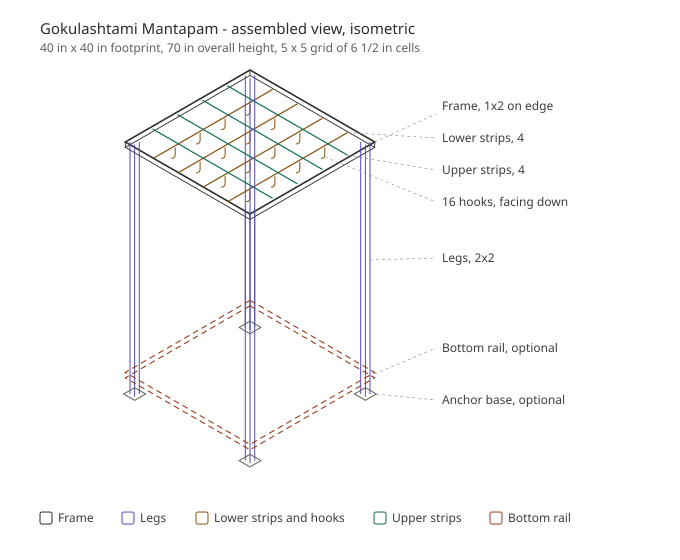
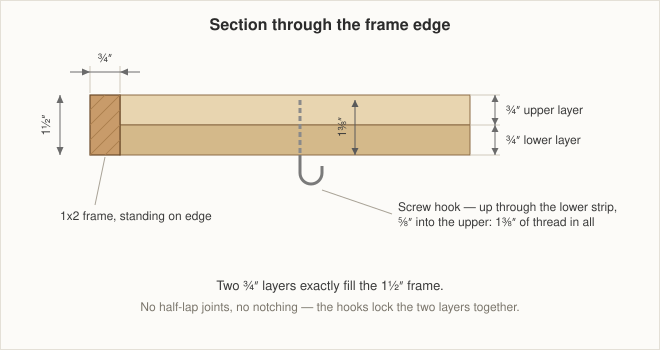
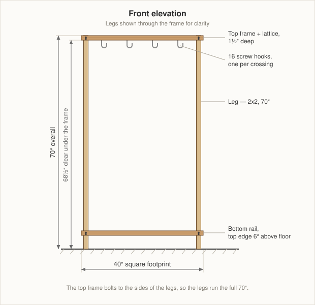
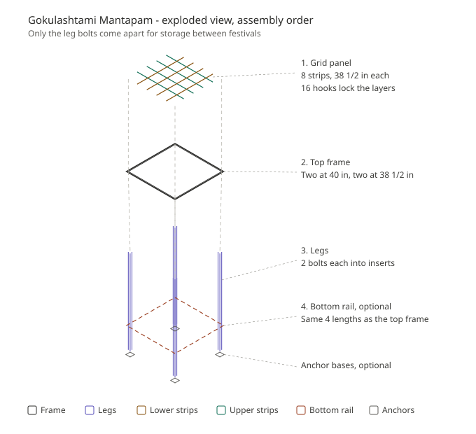
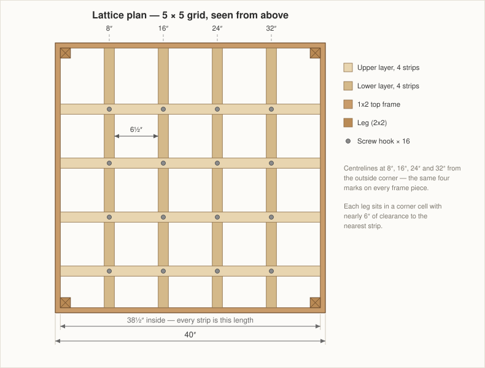
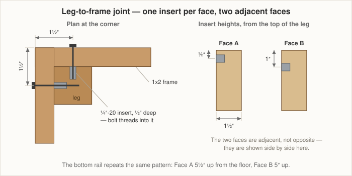

# Gokulashtami Mantapam
### 40" × 40" × 70" knock-down lattice canopy

A square open-grid mantapam with a 5 × 5 lattice roof, hanging hooks at every crossing, and legs that bolt on and off with stainless threaded inserts. It breaks down flat for storage between festivals. Buildable with a hand saw, a drill, and a mitre box.

**Key dimensions**

| | |
|---|---|
| Overall footprint | 40" × 40" |
| Overall height | 70" |
| Clear height under the frame | 68½" |
| Lattice cells | 5 × 5, each 6½" square |
| Lattice depth | 1½" (two ¾" layers) |
| Hooks | 16, one per crossing, facing down |

---

## 1. How it goes together

The whole design rests on one idea: **the 1x2 frame stands on edge (1½" tall), and the two layers of ¾" lattice strips exactly fill that 1½".** No half-lap joints, no notching. One set of four strips lies flat along the bottom half; the second set lies flat on top of them, flush with the top of the frame.

The numbers fall out clean:

- Inside opening: 40 − (2 × ¾) = **38½"**
- Four strips × 1½" = 6"; 38½ − 6 = 32½; ÷ 5 = **6½" cells**
- Strip centrelines at **8", 16", 24", 32"** measured from the outside corner — the same four marks on every frame piece

The build breaks into sub-assemblies:

1. **Lattice panel** — 8 strips locked into a rigid egg-crate by the 16 hooks. Built once, never taken apart.
2. **Top frame** — 4 pieces of 1x2 around the lattice panel.
3. **Legs** — 4 posts that bolt on with two stainless bolts each.
4. **Bottom rail** (optional but recommended indoors) — 4 more pieces of 1x2 near the floor.

For storage, undo the bolts and it becomes a flat 40 × 40 panel, four sticks, and four rails.

---

## 2. Read this before you buy anything

### 2.1 Indoors changes the stability plan

The design as originally drawn used [square post anchor bases](https://www.amazon.com/gp/product/B0D69RMWR3/) lag-bolted into a deck or slab. That works structurally — each leg becomes a cantilever fixed at the base — but **it requires drilling into your floor**, which you almost certainly don't want to do in a puja room or hall.

Those anchors have a 3½" × 3½" plate and only a **1¾" socket**. Sitting loose on a tiled or wood floor they do essentially nothing for racking; they are a foot, not a brace.

**For indoor use, add the bottom rail instead.** Four more 1x2 pieces, identical in length to the top frame, bolted to the legs with the same threaded-insert system about 6" above the floor. This turns four independent posts into a rigid box in both directions, with no floor fixing at all. It also gives you a natural ledge at the base — useful for lamps, kolam, or flower arrangements.

You can use both if you like. The rail does the structural work; the anchor plates just spread the load and protect the floor.

### 2.2 Leg length

The top frame does **not** sit on top of the legs — it bolts to their sides, with the leg top flush with the frame top at 70". So there is nothing to subtract except a base plate, if you use one.

| Setup | Leg length |
|---|---|
| Indoor, legs resting directly on the floor | **70"** |
| With anchor base plates (≈⅛" thick) | **69⅞"** |

Dry-fit one leg before cutting the other three — plate thickness varies by manufacturer.

The leg runs the full height through the lattice zone but never touches a strip: it occupies ¾"–2¼" in from the corner, and the nearest strip centreline is at 8". It sits in the empty corner cell with almost 6" to spare.

### 2.3 Wood choice indoors

Oak is a good choice for the visible frame: it takes a clear finish beautifully and is hard enough to survive years of setup and teardown.

Cedar remains an option if you like the colour and smell, and it's much lighter to carry, which matters for something you'll move every year.

### 2.4 Floor protection

Bare 2x2 end grain on tile or hardwood will mark it. Add stick-on felt pads to the bottom of each leg, or the anchor plates with felt underneath. This also lets you level small floor irregularities with a shim.

---

## 3. Materials

Prices are rough 2026 ballpark and vary by region. Home Depot and Lowe's stock varies by store — several of the links below may show "unavailable" online and still be on the rack locally, so check store inventory rather than trusting the web page.

### Option A — Oak (richer grain)

| Part | Product | Qty | ~Cost |
|---|---|---|---|
| Top frame + bottom rail | [ReliaBilt 1x2x8 unfinished oak](https://www.lowes.com/pd/ReliaBilt-1-in-x-2-in-x-8-ft-Square-Unfinished-Oak-Board/5002044635) | 4 | $60 |
| Lattice strips | [1x2x8 whitewood furring strip](https://www.lowes.com/pd/1-in-x-2-in-x-8-ft-Whitewood-Furring-Strip/1000427899) | 5 | $15 |
| Legs | [2x2x6 pine board](https://www.lowes.com/pd/Common-2-in-x-2-in-x-6-ft-Actual-1-5-in-x-1-5-in-x-6-ft-Pine-Board/1000110405) | 4 | $24 |

Buy 5 furring strips even though you need 4 — they are commonly bowed, wet, or twisted, and culling one is normal. Sight down every board in the store before it goes in the cart. A ¼" bow in a 70" leg will show badly.

If you skip the bottom rail, buy 2 oak boards instead of 4.

### Option B — cedar (lighter to carry, or if it will ever sit outdoors)

| Part | Product | Qty | ~Cost |
|---|---|---|---|
| Frame, rail, lattice | [1x2x8 cedar board](https://www.homedepot.com/p/1-in-x-2-in-x-8-ft-Cedar-Board-234926/203429559) — or [browse 1x2 softwood](https://www.homedepot.com/b/Lumber-Composites-Boards-Planks-Wood-Boards-Softwood-Boards/1-in-x-2-in/N-5yc1vZchznZ1z0n4tc) | 8–9 | $70 |
| Legs | [2x2x8 Premium S4S cedar](https://www.homedepot.com/p/2-in-x-2-in-x-8-ft-Premium-S4S-Cedar-Lumber-MR0510820/202302566) | 4 | $56 |

Cedar S4S is dimensionally accurate, which matters because the spacing math assumes a true 1½".

### Other substitutions

| Part | Alternate | Why |
|---|---|---|
| Frame | Poplar 1x2 | Best surface if you're painting; very straight; cheaper than oak |
| Frame | Primed finger-joint pine 1x2 | Cheapest paint-grade option |
| Frame | [Cedar-tone pressure-treated 1x2](https://www.homedepot.com/p/WeatherShield-1-in-x-2-in-x-8-ft-1-Cedar-Tone-Pressure-Treated-Board-163063/203982395) | Only if it will live outdoors; let it dry a few weeks before finishing |
| Lattice | Select pine 1x2 | Roughly 2× the price of furring, far straighter — worth it since strip straightness sets how the lattice reads |
| Legs | Poplar 2x2 | Straightest of the cheap options |
| Legs | Two 1x2s glued and screwed face-to-face | Fallback if every 2x2 in the bin is twisted |

---

## 4. Hardware

| Item | Qty | Notes |
|---|---|---|
| ¼"-20 stainless threaded inserts for wood, ½" long | 16 | 8 for the top frame, 8 for the bottom rail. [E-Z LOK at Home Depot](https://www.homedepot.com/p/E-Z-LOK-Threaded-Insert-for-Hard-Wood-303-Stainless-1-4-in-20-TPI-Internal-Threads-0-500-in-L-10-Pack-400-4-CR/309572727) |
| ¼"-20 × 1¼" stainless button-head or hex bolts | 16 | Plus 16 stainless flat washers |
| Screw hooks, ~#8 shank, 1½"+ thread | 16 | [Hillman 25-pack](https://www.lowes.com/pd/Hillman-Steel-Screw-Hook-25-Pack/4429182) · [all screw hooks](https://www.lowes.com/pl/hooks/screw-hook/4294710936-4294701973) · [stainless only](https://www.lowes.com/pl/hooks/stainless-steel/4294710936-4294780081) |
| #8 × 1¼" stainless wood screws | ~24 | Strip ends and frame corners |
| Felt floor pads | 4 | |
| Square post anchor base (optional) | 4 | [OTTFF, Amazon](https://www.amazon.com/gp/product/B0D69RMWR3/) |
| Wood glue | — | **Only** where you don't plan to disassemble |

**Insert type matters.** The E-Z LOK part linked above is their *hardwood* pattern (400 series). Your legs are softwood, so buy the **softwood version** (500 series, or any insert labelled for soft wood) — the hardwood knife thread can split pine or cedar. Threaded inserts are much cheaper online from a fastener supplier than at the big-box stores.

**Why only two inserts per leg per level?** A ¼"-20 insert is about 29/64" across. Two side by side on a 1½"-wide leg face would leave under 3/16" of wood at the edges and blow out. One per face, on two adjacent faces, is the limit — and with the bottom rail in place, four bolts per leg spread top and bottom is plenty.

### Hook load

A screw hook biting ~1⅜" into softwood is good for roughly 10–15 lb each on a straight downward pull. That covers garlands, mango-leaf toran, small lamps, strings of flowers, decorative butter pots, fairy lights.

**For anything heavier — a small unjal or cradle, a hanging brass lamp — do not use a hook.** Drill through an upper strip and use a ¼" through-bolt with a washer and lock nut on top, or better, span two strips with a short piece of hardwood and bolt through both. A hook can pull out; a through-bolt cannot.

### Fire safety

If you plan to place deepam or camphor near or under the structure, keep an open flame at least 18" clear of any wood, and never directly beneath the lattice — the grid will trap and channel heat. Unfinished wood, and especially anything you've oiled or varnished, ignites more readily than people expect. Battery or LED lamps are worth considering for anything hung from the lattice itself.

### Tools

You have the saw and drill. Add:

- **Plastic mitre box** (~$12) — non-negotiable. Twenty-plus hand-sawn square cuts is where this project succeeds or fails.
- Speed square, tape, pencil
- Countersink bit
- Drill bits: 7/64" (hook pilots), 9/64" (screw pilots), 9/32" (bolt clearance), and whatever size your inserts specify (typically 3/8")
- 2–4 clamps
- Sanding block, 120 and 180 grit
- Hex key or driver for the bolts

---

## 5. Cut list

| Part | Qty | Length | Material |
|---|---|---|---|
| Top frame, front and back | 2 | 40" | 1x2 |
| Top frame, left and right | 2 | 38½" | 1x2 |
| Bottom rail, front and back | 2 | 40" | 1x2 |
| Bottom rail, left and right | 2 | 38½" | 1x2 |
| Lattice strips (both layers) | 8 | 38½" | 1x2 |
| Legs | 4 | 70" (or 69⅞" with plates) | 2x2 |
| Spacer blocks (jig, not part of the build) | 4 | 6½" | offcut |

**Board yield**

- Frame and rail: four 8-ft boards → two boards give 40" + 40", two give 38½" + 38½"
- Lattice: four 8-ft boards → two 38½" pieces each, 19" left over per board
- Legs: one board per leg. A 6-ft (72") board leaves only 2" spare, so cut carefully and buy a spare if your stock has damaged ends
- Spacers: cut from lattice offcuts

**On the spacer blocks:** they set the strip spacing without measuring 40 times. Cut them to `(38½ − 4 × your actual strip width) ÷ 5`. If your strips measure a true 1½", that's 6½". Furring often runs 1‑7/16", which gives 6.55" — round to 6-9/16" and it will look identical.

---

## 6. Build steps

### Step 1 — Cut and sort

Cut everything to the list above. Use the mitre box; a cut that's 2° off square will telegraph through the whole frame. Sand the faces and knock the sharp corners off every piece now, while they're loose — it's miserable later.

Set the four straightest strips aside for the **upper** layer. Those are the ones seen from below.

### Step 2 — Mark the frame and rail

On the inner face of all four top-frame pieces, mark strip centrelines at **8", 16", 24", 32"** from one end. Mark every piece from the same end so any small error stays consistent.

Mark bolt lines too: ½" and 1" down from the top edge, at each end of every top-frame piece. On the bottom rail pieces, mark ½" and 1" down from the *top* edge of the rail as well — same pattern.

### Step 3 — Build the lattice panel, upside down

Work on a flat floor. Build it inverted so you can drive the hooks straight down.

*The plan above shows the panel the right way up — the layer you lay down first ends up on top after the flip.*

1. Lay the four **upper** strips down, parallel, spaced with your blocks.
2. Lay the four **lower** strips across them, spaced the same way.
3. Square the panel: measure both diagonals of the outer rectangle and adjust until they match. Clamp or weight it.
4. At each of the 16 crossings, drill a **7/64" pilot straight down through the lower strip and about ⅝" into the upper strip** — roughly 1⅜" total. Tape on the bit marks your depth.
5. Drive a screw hook into each pilot. Hand-tight plus a firm quarter turn; over-torquing strips softwood.
6. Flip the panel. The hooks now hang below it.

You should be able to lift the whole panel by one corner without it racking.

### Step 4 — Install the inserts in the legs

For each leg, pick two adjacent faces — these face outward toward the frame.

**Top frame (measured from the top of the leg):**
- Face A: one insert, centred across the width, **½" down**
- Face B: one insert, centred across the width, **1" down**

**Bottom rail (measured from the bottom of the leg), placing the rail's top edge at 6":**
- Face A: one insert **5½" up**
- Face B: one insert **5" up**

The ½" vertical offset between faces is deliberate. Both inserts reach ½" into a 1½" leg, so at the same height they'd collide in the middle. Offset them and they clear completely.

Drill to the insert manufacturer's spec (usually 3/8"), then drive each insert flush or a hair below the surface. Go slow and keep it square — a cocked insert is very hard to recover. Practice on an offcut first.

### Step 5 — Assemble the top frame around the panel

1. Stand the panel on blocks so the hooks hang clear.
2. Fit the two 38½" frame pieces against opposite edges, then the two 40" pieces over their ends. The short pieces sit **between** the long ones.
3. Drive one #8 × 1¼" stainless screw through the frame into the end of each strip — 16 total. Pilot every hole at 9/64" and countersink.
4. Two more screws per corner through the 40" piece into the end of the 38½" piece.

This is the one connection not meant for repeated opening. It doesn't matter, because the disassembly you actually want is at the legs.

### Step 6 — Drill for bolts and hang the legs

At each corner of the top frame, drill **9/32" clearance holes**: one at ½" down on one face, one at 1" down on the adjacent face, positioned **1½" in from the outside corner** on both faces. Repeat the same pattern on the bottom rail pieces.

Tuck each leg into its inside corner, line up the inserts, and run a ¼"-20 × 1¼" stainless bolt with a washer into each. Snug, not gorilla-tight — you're threading into stainless set in wood.

Bolt length check: ¾" frame + 1/16" washer leaves about 7/16" of thread in a ½" insert. It engages properly and won't bottom out.

### Step 7 — Bottom rail, then stand it up

Fit the bottom rail exactly as you did the top frame — short pieces between long ones, two bolts per leg. Stand the mantapam up, check it for square and level, and shim under a leg if your floor isn't flat.

Do not twist the frame to take up a wobble. That puts permanent load into the bolted joints and will loosen the inserts over time.

Add felt pads under the legs last.

---

## 7. Finishing

Finish **before** final assembly if you're staining, oiling, or painting — all the inside faces of the lattice become unreachable once the hooks are in.

For a piece brought out once a year and handled a lot, a wiping varnish or hardwax oil on oak is worth the effort. Two coats, sanded lightly between, and the mantapam will look better after ten festivals than after one.

If you plan to tie flowers, banana stem, or fabric directly to the legs each year, avoid a high-gloss finish — it scuffs visibly where twine bites.

---

## 8. Taking it apart

1. Unhook everything.
2. Undo 8 bolts at the bottom rail. The rails come off.
3. Undo 8 bolts at the top. The legs come off.

Result: one 40" × 40" × 1½" flat panel, four legs, four rails, and a bag of 16 bolts. Reassembly is a fifteen-minute job.

**Mark the legs and their matching corners** with a pencil on a hidden face, and reassemble in the same orientation every year. The insert holes are drilled to fit, not to be interchangeable.

Store the panel flat and on edge if possible, somewhere dry. Lying flat under weight for a year will let the strips take a set.

---

## 9. Rough budget

| | Option A, indoor | Option B, cedar |
|---|---|---|
| Lumber | $99 | $126 |
| Inserts, bolts, washers | $55 | $55 |
| Hooks | $10 | $12 |
| Screws and felt pads | $18 | $18 |
| Anchor bases (optional) | $25 | $25 |
| **Total** | **~$180–205** | **~$210–235** |

---

## 10. Notes and cautions

- **Pre-drill everything in oak.** Red oak splits readily at ¾" thickness, especially near ends.
- **Furring strips are often thinner than ¾"**, sometimes 11/16". Your two layers may sit ⅛" shy of the frame top. Keep the upper layer flush with the top and let the gap fall at the bottom, where nobody looks.
- **Measure your actual strip width** and adjust the spacer blocks, but keep marking centrelines at 8/16/24/32 regardless. Even centreline spacing is what makes the lattice look right.
- **Load limits:** this is a light decorative structure. Garlands, toran, cloth, lamps, small hanging items. Anything with real weight needs a through-bolt, not a hook — see §4.
- **If it will ever go outdoors,** even under a porch, switch to cedar throughout. Red oak and whitewood furring degrade quickly in the weather.
