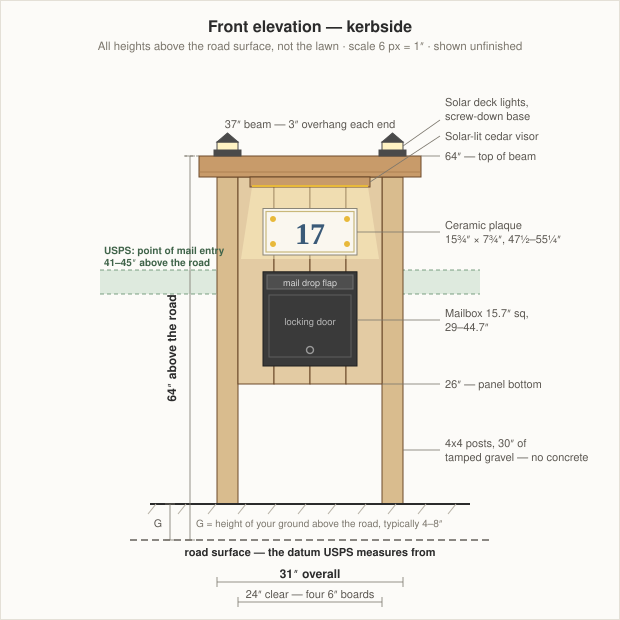
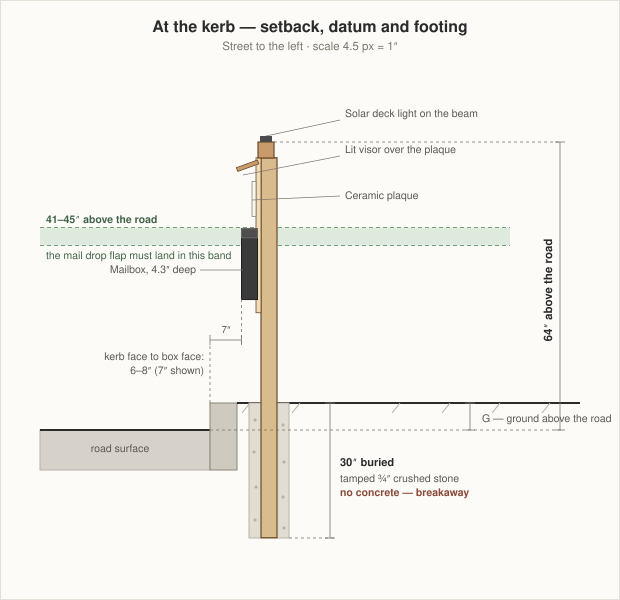
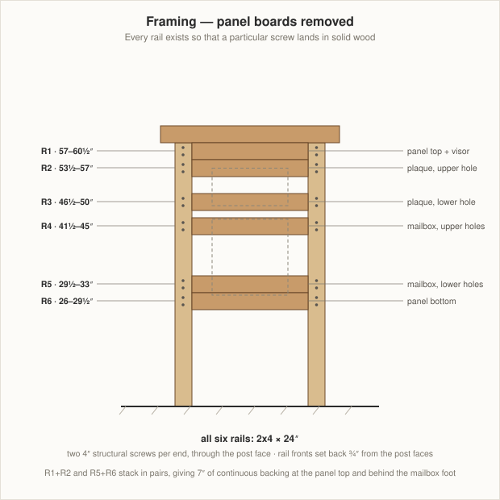

# Mailbox Post — wall-mount version (superseded)
### 31" × 64" kerbside cedar panel post, solar-lit

> **Superseded.** This design carried a wall-mount box, which is approved for door delivery
> rather than kerbside — see §1.1 below. It was replaced by a USPS-approved post-mount box on
> the same cedar frame, drawn two ways:
> **[perpendicular to the street](MailboxPostPerpendicular.md)** (recommended) and
> **[parallel to the street](MailboxPostParallel.md)**.
> Kept for the reasoning in §1–§2, which still applies.

A two-post cedar panel carrying a wall-mount locking mailbox and a ceramic address plaque, lit by solar. The panel is a skin over a ladder of 2x4 rails set at heights chosen from the hardware, so every screw lands in solid wood. Because it stands at the kerb, the geometry is driven by the USPS delivery rules rather than by what looks nice — heights are measured from the **road surface**, and the footing is deliberately weak.

**Key dimensions**

| | |
|---|---|
| Overall width | 31" (two 4x4s, 24" clear between them) |
| Top of beam | 64" above the road surface |
| Crossbeam | 37" long — 3" overhang each end |
| Panel | 24" × 34½", four 6"-wide vertical cedar boards |
| Mailbox | 29" – 44.7", drop flap at ≈43" |
| Post burial | 30" of tamped crushed stone, **no concrete** |
| Kerb setback | 6"–8" from the kerb face to the box face |

**What sits where** — all above the road surface

| Component | Height |
|---|---|
| Solar deck lights | on the beam top, over each post |
| Lit cedar visor | hangs from 60½", tilted 20° down |
| Ceramic plaque, 15¾" × 7¾" | 47½" – 55¼" |
| Mailbox, 15.7" square × 4.3" deep | 29" – 44.7" |
| Panel bottom | 26" |

---

## 1. Read this first — three things that can stop the build

### 1.1 A wall-mount box is not automatically allowed at the kerb

This is the one that can sink the whole project, so settle it before you buy anything.

Boxes used for **kerbside** delivery must be USPS-approved — the tunnel-shaped T1/T2/T3 style that carries the "Approved by the Postmaster General" marking. The [Ydocabinit wall-mount box](https://www.amazon.com/dp/B09XM4BTK7/) is a wall/door-delivery box and carries no such marking.

That is not necessarily fatal. USPS also permits **custom-built boxes approved by your local Postmaster**, and a locking box on a solid post is often waved through. But it is the Postmaster's call, not yours, and a carrier can decline to deliver to a box that has not been approved.

**Go to your Post Office, describe what you are building, and get a yes.** Take the elevation drawing with you.

If the answer is no, the post survives unchanged — you lose only the panel-mounted mailbox. Fit an approved T2 box on a short 4x4 arm cantilevered off the street-side post at the same 41"–45" band, and keep the plaque, the visor and the lighting on the panel exactly as drawn. That version arguably looks better anyway, because the approved box reads as a mailbox and the panel reads as a sign.

### 1.2 There is no outgoing-mail flag

Kerbside boxes have a flag so you can signal outgoing mail. This box does not have one — it was designed for a wall, where you hand your outgoing mail to a carrier who is already at your door.

Buy a bolt-on replacement mailbox flag (about $10) and mount it on the street side of the panel, level with the mailbox, so the carrier sees it from the vehicle. It is two screws and it restores the function.

### 1.3 A 31"-wide two-post structure at the kerb is a roadside obstacle

USPS and FHWA guidance for mailbox supports is that they should **give way when struck**: a single 4x4 wood post or a 2"-diameter steel pipe, buried no more than about 24", and **not set in concrete**.

What you have asked for is two 4x4 posts, 31" apart, carrying a solid panel. That is roughly twice the impact resistance of the standard support, and it is wider than a car's tyre track, so a vehicle leaving the road is more likely to hit it squarely.

**This design goes as far toward compliance as it can:** 30" of tamped crushed stone, no concrete, so the posts can rotate and pull out rather than snap a bumper. But be straight with yourself about it — it is a stiffer object at the road edge than a single post would be, and if your road is fast, narrow, or icy, that matters.

Call the town before you dig. Many municipalities have their own rules for objects in the right-of-way, and this is exactly the sort of thing they have opinions about.

---

## 2. The geometry the rules dictate

### 2.1 Heights are measured from the road, not from your lawn

USPS measures from the **road surface**. Your post stands behind the kerb, where the ground is typically 4"–8" higher. Get this wrong and a box you carefully set at 43" above your grass sits at 37" above the road, which is out of band.

Every height on this page is **above the road surface**.

Measure how much higher the ground is at the post than the road surface. Call it **G** — 6" is typical behind a standard kerb. Then:

- **Exposed post length** = 64 − G (58" if G is 6")
- **Post length to buy** = 94 − G, so an 8' post covers every case with a bit to trim

Run a straightedge and a level out from the kerb top to find G honestly; a lawn that slopes up away from the road will lie to you if you measure at the wrong spot.

### 2.2 The 41"–45" band sets the mailbox

USPS wants the **point of mail entry** 41"–45" above the road. On this box the mail drop is the hinged flap across the top of the front face, not the locking door below it.

**Set the box so that flap sits at 43"** — the middle of the band, which leaves you 2" of margin in each direction for a future repaving or a settled post. With the flap about 1½" below the top of the box, that puts the box at **29" – 44.7"**, which is what the rails below assume.

Measure your own box. If the flap is somewhere else, move R4 and R5 to suit and leave everything else alone.

### 2.3 The setback sets the post position

USPS wants the **face of the box** set back 6"–8" from the face of the kerb. The box projects 4.3" from the panel, and the panel is flush with the post faces, so:

**Post front face = kerb face + 11"** (for a 7" setback, mid-range).

With no kerb, measure from the edge of the travelled way instead, and give yourself the full 8".

### 2.4 Why the post grew to 64"

The mailbox is pinned at 29"–44.7" by the rules above. The plaque needs to be **above** it — that is where it is visible from a car and where a solar visor can be fitted with the panel facing the sky. Stack a 7¾" plaque, a visor and sensible gaps on top of a mailbox that ends at 44.7" and you land at 64" to the top of the beam.

Forcing it back to 60" leaves about ½" between the plaque and the visor, which looks like a mistake. **64" is 5'4" — still a mailbox post, not a monument**, and the extra 4" costs nothing since it comes out of the same 8' stick.

If 60" really is a hard limit, put the plaque **below** the mailbox at roughly 15"–23", drop the visor, and light the whole panel with two black solar spot lights staked at the base. It works; it just puts your house number where snow and grass get at it.

---

## 3. How it goes together

Three numbers do the work.

**The 24" clear span comes from the boards.** A 1x8 is really 7¼" wide. Rip four to 6" and you get 24" of panel exactly, with the offcuts left for the visor. Add the two 3½" posts and the frame is 31" overall — past the 30" asked for, and every number is one you can find on a tape.

**The beam sits on top, not into the posts.** No half-lap, no notching — two structural screws straight down into each post's end grain. Setting the beam forward ¾" of the post faces gives the panel a drip edge and a shadow line for free.

**The panel is a skin, not the structure.** A ¾" cedar board will not hold a 15.7" steel mailbox and a ceramic tile. Six 2x4 rails behind it do that, and **each rail exists because a specific screw has to land in it.**

| Rail | Height | Backs |
|---|---|---|
| R1 | 57 – 60½" | panel top, and the visor's mounting screws |
| R2 | 53½ – 57" | plaque, upper hole |
| R3 | 46½ – 50" | plaque, lower hole |
| R4 | 41½ – 45" | mailbox, upper holes |
| R5 | 29½ – 33" | mailbox, lower holes |
| R6 | 26 – 29½" | panel bottom |

R1+R2 and R5+R6 stack in pairs, each giving 7" of continuous backing — at the top, where the visor hangs and wind load is highest, and at the mailbox foot, which takes the weight of a carrier leaning on an open door.

The rails are set back ¾" from the front faces of the posts, so the panel boards land flush with the posts. From the street you see one flat plane with two posts framing it and the beam floating ¾" proud above.

**Those heights assume the hardware's holes sit ½"–1½" in from each edge.** They almost certainly do, but dry-fit and mark before you commit — see step 5.

---

## 4. Finish — the house sets the palette

From the front facade: cream lap siding, **charcoal-black shutters and hardware**, white window trim, a mixed fieldstone skirt, a dark grey roof, and black path lights already lining the walkway.

Natural cedar is the wrong answer. Cedar is a warm tan and the siding is a warm cream — side by side they read as a near-miss rather than a contrast.

**Finish the post in a charcoal-black semi-solid exterior stain, matched to the shutters.** Three things follow:

- The black mailbox stops looking like an appliance bolted to a fence and disappears into the post.
- The white-and-yellow ceramic plaque becomes the only bright object on the whole thing, which is exactly what you want the eye to find from a moving car.
- The post joins the house's black-accent family — shutters, garage door hardware, path lights — instead of being a fourth material.

Two optional touches that cost almost nothing:

- A ¾" × 1½" **white-painted trim frame** around the plaque, echoing the window trim. Four mitred sticks.
- A small bed of **fieldstone or river rock** at the base, matched to the garage skirt. It ties the post to the house, and it keeps the string trimmer off the posts.

Buy **black** solar deck lights and stake lights so they match the path lights that are already there.

---

## 5. The lighting

Two layers, and only one of them has to work well.

**The visor light is the one that matters.** A ¾" × 5" × 20" cedar board hangs off R1 at 60½", tilted 20° down and forward. A waterproof warm-white LED strip runs along its underside; its solar panel screws flat to the top of the beam, and the wire runs down the *back* of the beam and forward along its underside in a ⅜" groove, so nothing shows from the street.

Two details separate a lit number from a glare spot:

- **Warm white, 2700–3000K.** Cool white goes blue against cream siding and makes glossy ceramic look like a phone screen.
- **Graze it, don't face it.** The plaque is glossy. Light aimed straight at it bounces back as a hot spot. The 20° tilt and the 4½" standoff throw light down across the face instead, which reads the numbers and kills the reflection.

**The two beam lights are ambient.** Flat-base solar deck lights screwed to the beam top, directly over each post, where there is 3½" of solid post underneath. They mark where the post is from a car. Buy the screw-down kind — a slip-over 4x4 post cap has nowhere to go, because the beam covers both post tops.

Solar downlights are dim. Buy the strip kit with the largest **separate** panel you can find; a panel integrated into the fixture will not charge under a visor.

If the visor light disappoints, the fallback is two black solar spot lights staked at the base, uplighting the panel. Uplighting a black panel with a white tile on it is very effective and needs no wiring at all.

---

## 6. Materials

Rough 2026 prices; stock varies by store.

| Part | Product | Qty | ~Cost |
|---|---|---|---|
| Posts | 4x4 × 8' ground-contact pressure-treated | 2 | $36 |
| Beam | [4x4 × 8' cedar](https://www.homedepot.com/b/Lumber-Composites-Dimensional-Lumber/4-in-x-4-in/N-5yc1vZbqmzZ1z0uabt) | 1 | $48 |
| Panel + visor | 1x8 × 8' cedar | 3 | $90 |
| Rails | 2x4 × 8' cedar | 2 | $26 |
| Footings | ½ cu ft bag of ¾" crushed stone | 6 | $30 |
| Finish | 1 qt charcoal semi-solid exterior stain | 1 | $30 |
| | | | **$260** |

Buy a fourth 1x8 if the rack is rough — you are ripping these to 6", and a bad edge or a loose knot on the rip line costs a whole panel board.

**Posts should be ground-contact pressure-treated (UC4A), not cedar.** It is the buried part that fails, and 30" in wet soil is exactly where cedar disappoints. Stained charcoal, PT is indistinguishable from cedar. Everything above grade — beam, rails, panel, visor — should be cedar, which takes stain better and will not be wet and shrinking on the day you build. Let PT posts dry a couple of weeks before staining.

The cedar 4x4 leaves a 59" offcut. Keep it for the mailbox arm if §1.1 goes against you.

### Mounted hardware

| Part | Product | Qty | ~Cost |
|---|---|---|---|
| Mailbox | [Ydocabinit wall-mount, 15.7" sq × 4.3", black](https://www.amazon.com/dp/B09XM4BTK7/) | 1 | $55 |
| Address plaque | [Ceramic tile plaque, 15¾" × 7¾"](https://www.amazon.com/Yellow-Flowers-Address-Ceramic-Number/dp/B0BM6Q8RH7/) | 1 | $45 |
| Outgoing-mail flag | bolt-on replacement mailbox flag, black | 1 | $10 |
| Beam lights | solar deck light, flat screw-down base, black | 2 | $30 |
| Plaque light | solar LED strip kit, warm white, separate panel on 6'+ of lead | 1 | $28 |
| | | | **$168** |

---

## 7. Hardware and tools

**Fasteners — stainless or hot-dip galvanised throughout.** Cedar's tannins and PT's copper both eat plain and electro-galvanised steel, and the streaks show within a season.

| Use | Fastener | Qty |
|---|---|---|
| Beam to posts | ¼" × 6" structural screw | 4 |
| Rails to posts | ¼" × 4" structural screw | 24 |
| Panel boards to rails | #8 × 1½" stainless trim-head screw | ~48 |
| Mailbox | #10 × 2½" stainless | as supplied + spares |
| Plaque | stainless screws as supplied | 2 |
| Visor and cheeks | #8 × 2" stainless | 8 |

**Tools:** post-hole digger or auger, a post level, a long straightedge and a line level for finding G, circular or table saw for the rips, drill/driver, ⅜" straight bit or a chisel for the wire groove, a tamping bar, tape and square.

The only cut needing care is ripping the 1x8s to 6". Rip all four at one saw setting so they are identical.

---

## 8. Cut list

G is your ground height above the road, from §2.1.

| Part | Size | Qty | Yield |
|---|---|---|---|
| Post | 4x4 × (94 − G)" — 88" if G is 6" | 2 | one 8' stick each |
| Beam | 4x4 × 37" | 1 | one 4x4 × 8', 59" left over |
| Rail | 2x4 × 24" | 6 | four per 8' board; 2 boards, two rails spare |
| Panel board | ¾" × 6" × 34½" | 4 | two per 1x8 × 8' after ripping to 6"; 2 boards |
| Visor | ¾" × 5" × 20" | 1 | third 1x8 |
| Visor cheek | ¾" triangle, 5" × 2" | 2 | third 1x8 |

---

## 9. Build steps

**1 — Find the datum and mark out.** Run a straightedge from the kerb top back to the post line and measure G with a line level. Mark the post front face at **kerb face + 11"**, and the two post centres 27½" apart, parallel to the road.

**2 — Set the posts.** Dig two 10"-diameter holes 30" deep. Put 4" of crushed stone in the bottom of each, stand the posts, brace them plumb both ways, and backfill with crushed stone in 4"–6" lifts, **tamping hard between every lift**. No concrete. Loose backfill is the failure mode here — a well-tamped stone footing is most of what holds this up.

Check that the two **front faces** are in one plane and 27½" apart on centre before you backfill. That plane is the whole design. Screw a scrap 2x4 across the front faces at each end as a temporary spacer and leave it there while you tamp.

**3 — Fit the beam.** Cut the 4x4 to 37" and chamfer the ends. Sit it on the post tops, overhanging 3" at each end and set forward ¾" of the post faces, with the top at 64" above the road. Counterbore and drive two ¼" × 6" structural screws down into each post's end grain, offset either side of centre so they do not split it.

Cut the ⅜" × ⅜" wire groove down the beam's back face and forward along its underside to the centre — much easier before the beam goes on.

**4 — Hang the rails.** Cut six 2x4s to 24". Mark the heights from §3 on both posts, remembering they are above the road. Set each rail with its front face ¾" back from the post front face — cut a ¾" scrap as a gauge block and hold it while you drive. Two ¼" × 4" structural screws through the outside of each post into each rail end.

**5 — Dry-fit, then adjust.** Hold the mailbox and the plaque against the rails and mark where their holes actually fall. Check the mailbox flap against 43" with a tape from the road surface. If a hole misses its rail, move the rail — it is four screws. **Do this now.** Once the panel is on you cannot reach behind it.

**6 — Rip and fit the panel.** Rip four 1x8s to 6" wide, cut to 34½", and screw them to all six rails, two screws per board per rail. Leave a 1/16" gap between boards for movement. The outer boards butt the post inner faces and finish flush with the post front faces.

**7 — Build and hang the visor.** Cut the visor board and its two triangular cheeks. Screw the cheeks to R1 at 20°, then the visor to the cheeks. Fish the wire through the groove, mount the solar panel on the beam top, tape the LED strip to the visor's underside.

**8 — Finish before the hardware goes on.** Two coats of charcoal semi-solid stain on everything, end grain first and twice. Do not skip the tops of the boards or the underside of the beam. Let it cure.

**9 — Mount the hardware.** Plaque, then mailbox, then the flag — top down, so nothing is dropped on something already fitted. Seal behind each plaque screw hole with a dab of clear exterior sealant.

**10 — Verify, then check at night.** Measure the flap height from the road one more time and confirm the setback. Give the solar gear a full day of sun before you judge it, then go and stand where the carrier stops and see whether you can read the number.

---

## 10. Budget

| | |
|---|---|
| Lumber, stone, stain | $260 |
| Fasteners | $50 |
| Mounted hardware and solar | $168 |
| | **≈ $478** |

---

## 11. Notes and cautions

- **Call 811 before you dig.** Two 30" holes at the road edge is exactly the depth and place that finds an irrigation line, a low-voltage lighting run, a water service, or worse. It is free, it takes a few days, so call before you buy lumber.
- **Settle §1.1 with the Postmaster first.** Everything else is reversible; buying a box that will not be delivered to is not.
- **Check the right-of-way.** The strip between the kerb and the property line often belongs to the town, not to you, and a 31"-wide structure standing in it is theirs to remove.
- **Snow and plough wash.** A kerbside post takes the full load of ploughed snow. The panel bottom at 26" keeps the boards out of most of it, but the posts will take a beating. Do not plant anything at the base that you would mind losing.
- **The panel will move.** Cedar boards 6" wide will shrink and swell across the grain by up to 1/16" through the year. The gaps between boards are deliberate — do not close them up and do not caulk them.
- **Re-check the height after the first winter.** A tamped-stone footing is meant to be less rigid than concrete, and a post that has settled or leaned an inch can put you out of the 41"–45" band. It is a five-minute check with a tape.
- **Repaving raises the road.** If the town resurfaces, the road comes up and your measured height goes down. Two inches of new asphalt eats your whole lower margin, which is why the flap is set at 43" and not 41".

---

← [DIY projects](README.md) · [Wiki home](../README.md)
