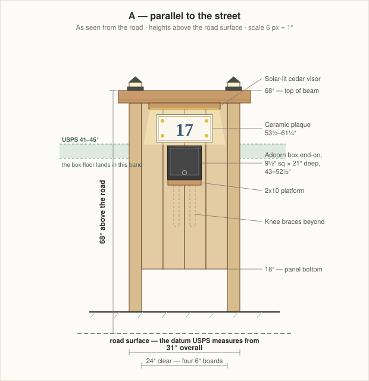
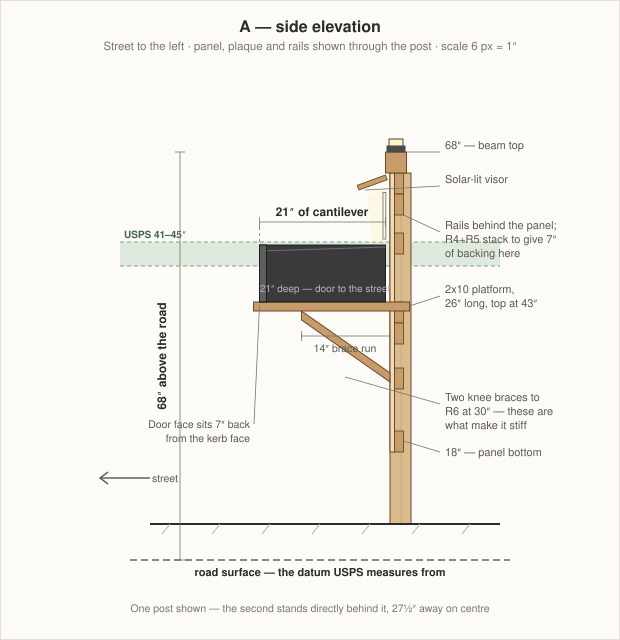

# Mailbox Post — Parallel
### Adoorn post-mount box on a 31" × 68" cedar sign panel, face-on to the street

Two 4x4 posts standing side by side along the road carrying a 31"-wide cedar panel, with the [Adoorn post-mount mailbox](https://www.adoorn.com/products/post-mount-mailbox) cantilevered toward the kerb on a braced platform and a ceramic address plaque above it, lit by a solar visor.

This is the **signage** option: a flat face aimed at the road, with the house number at driver eye level. It costs you a bigger wind sail, a bigger roadside obstacle, and a 21" cantilever carrying the mailbox. [The perpendicular version](MailboxPostPerpendicular.md) avoids all three and is the one I'd build — read §1 before choosing.

**Key dimensions**

| | |
|---|---|
| Facing the road | 31" (posts 27½" on centre, 24" clear) |
| Top of beam | 68" above the road surface |
| Mailbox floor | 43" above the road, projecting 21" toward the kerb |
| Kerb setback | 7" from the kerb face to the box door |
| Panel | 24" × 46½", four 6" boards |
| Post burial | 30" of tamped crushed stone, **no concrete** |

---

## 1. Choose this one deliberately

**What it buys you.** A 31"-wide face aimed straight at the road, with the number at 53½"–61¼" — squarely in a driver's line of sight and unobstructed by the mailbox. Nothing else in this project reads as well from across the street, and one plaque does the job instead of two.

**What it costs you.**

*A 21" cantilever.* The box's 21" length runs toward the road, so it hangs off the panel on a platform and two knee braces — see the side elevation above. That joint carries 15 lb of box, a few pounds of mail, and a carrier pulling the door open several hundred times a year. It is entirely buildable — the braces below make it stiff — but it is a moving, loaded joint where the perpendicular version has none.

*About 10 sq ft of sail.* A 46½" × 24" panel plus the beam, all facing the prevailing weather, on two posts in a deliberately weak footing.

*A bigger thing to hit.* Kerbside supports are meant to give way when struck. This one shows 31" of panel to traffic instead of a 3½" post edge — wider than a car's tyre track, so a vehicle leaving the road is more likely to hit it squarely. **If your road is fast, narrow or icy, build the perpendicular version.**

*Height.* Fitting the plaque above a box whose floor is pinned at 43" pushes the beam to 68". That is 5'8".

---

## 2. The mailbox, and using your own post

The [Adoorn post-mount box](https://www.adoorn.com/products/post-mount-mailbox) is **9½"H × 9½"W × 21"D**, 15 lb, galvanized steel with a powder-coat finish, and **approved by the USPS Postmaster General** — so a carrier cannot decline it, which the wall-mount box could not promise.

**Order it in Black** to match the shutters, the garage door hardware and the path lights already on the house.

### Replacing Adoorn's post

Adoorn sells a 51" in-ground post for it and you are not using it. Skipping it costs nothing and gains the height being yours to set, somewhere for the plaque and the lighting to live, and cedar instead of a steel tube.

The one thing you inherit is the **bolt pattern**. Adoorn's plate is 12" × 6" with a **10" × 4" hole spread**, and the box floor is drilled to match. Your platform reproduces those four holes: **10" apart** along the box's length (here, running toward the road) and **4" apart** across it.

**Measure the holes on your actual box before you drill.** Set the box upside down on the platform blank and mark through its floor. A 10" × 4" pattern is easy to get 1/16" wrong from a spec sheet and impossible to get wrong from the box.

Use Adoorn's hardware if it is long enough for a 1½" platform; otherwise ¼-20 stainless bolts with a washer and a nylon-insert lock nut underneath.

### Check for a flag

Kerbside boxes need a flag for outgoing mail. Adoorn's locking models list one; the no-lock listing does not say. **Check before ordering** — a bolt-on flag is about $10 if it has none.

---

## 3. The geometry the rules dictate

### 3.1 Heights are measured from the road

USPS measures from the **road surface**, not your lawn, and the ground behind a kerb is typically 4"–8" higher. Every height here is **above the road surface**.

Measure how much higher your ground is than the road at the post — call it **G**, 6" is typical. Then:

- **Exposed post** = 68 − G (62" if G is 6")
- **Post to buy** = 98 − G

An 8' stick covers this when **G is 2" or more**. If your ground is nearly level with the road, buy 10' posts.

### 3.2 The 41"–45" band sets the platform

USPS wants the box floor 41"–45" above the road. **Set it at 43"** — mid-band, 2" of margin each way for a resurfacing or a settled post. With a 1½" platform, the platform's underside is at 41½".

### 3.3 The setback sets where the post goes

USPS wants the box door 6"–8" back from the kerb face. Use **7"**. The box projects 21" from the panel face, so:

**Post front face = kerb face + 28"**

That is the one number that differs most from the perpendicular version, and it is worth checking twice — 28" back from the kerb may put the posts further into the lawn than you expect.

---

## 4. How it goes together

**The 24" clear span comes from the boards.** A 1x8 is really 7¼" wide. Rip four to 6" and you get 24" exactly, with the offcuts left for the visor. Add the two 3½" posts and the frame is 31" overall.

**The beam sits on top of the posts** — two structural screws down into each post's end grain, 37" long with a 3" overhang each end, set forward ¾" of the post faces to throw a drip line.

**The mailbox hangs on a braced platform.** A 2x10 laid flat, 26" long, running front to back with its top at 43". It bears on the panel face and on two cedar knee braces that run down to the panel at 30". The braces are what make this work — without them a 21" cantilever off a ¾" panel is a hinge.

**The panel is a skin, not the structure.** Seven 2x4 rails do that work, and each one exists because a specific screw has to land in it.

| Rail | Height | Backs |
|---|---|---|
| R1 | 61 – 64½" | panel top, and the visor |
| R2 | 57½ – 61" | plaque, upper hole |
| R3 | 51 – 54½" | plaque, lower hole |
| R4 | 39½ – 43" | platform |
| R5 | 36 – 39½" | platform |
| R6 | 28½ – 32" | knee brace feet |
| R7 | 18 – 21½" | panel bottom |

R1+R2 stack to give 7" of continuous backing at the top where the visor hangs. **R4+R5 stack to give 7" behind the platform** — that is the most heavily loaded point on the whole structure and it wants every bit of it.

Rails are set back ¾" from the post front faces so the panel boards finish flush with the posts.

**Those heights assume the plaque's holes sit about ½" in from its top and bottom edges.** Dry-fit and mark before you close the panel — see step 6.

---

## 5. Finish

The house is cream lap siding with **charcoal-black shutters and hardware**, white trim, a fieldstone skirt and black path lights along the walkway.

Natural cedar is the wrong answer — a warm tan against a warm cream reads as a near-miss. **Finish the post in a charcoal-black semi-solid exterior stain matched to the shutters.** The black mailbox merges into the post and the white-and-yellow plaque becomes the only bright object, which on a panel this size is the whole point.

Two cheap touches: a white-painted ¾" × 1½" trim frame around the plaque, echoing the window trim; and a small fieldstone bed at the base, echoing the garage skirt.

---

## 6. The lighting

**The visor does the work.** A ¾" × 5" × 20" cedar board hangs off R1 at 64½", tilted 20° down and forward, with a waterproof warm-white LED strip along its underside washing the plaque. Its solar panel screws flat to the beam top and the wire runs down the beam's back face and along its underside in a ⅜" groove, out of sight from the street.

- **Warm white, 2700–3000K.** Cool white goes blue against cream siding and makes glossy ceramic look like a phone screen.
- **Graze it, don't face it.** The plaque is glossy; light aimed straight at it comes back as a hot spot. The 20° tilt throws it down across the face instead.

**The beam lights are ambient.** Flat-base solar deck lights on the beam top over each post — the screw-down kind, because a slip-over 4x4 cap has nowhere to go when a beam covers the post tops. Buy them black.

Get a strip kit with the largest **separate** panel you can find; a panel built into the fixture will not charge under a visor. Two black solar spot lights staked at the base are the no-wiring fallback, and on a panel this size they work very well.

---

## 7. Materials

Rough 2026 prices; stock varies by store.

| Part | Product | Qty | ~Cost |
|---|---|---|---|
| Posts | 4x4 × 8' ground-contact pressure-treated (10' if G < 2") | 2 | $36 |
| Beam | 4x4 × 8' cedar | 1 | $48 |
| Panel + visor | 1x8 × 8' cedar | 3 | $90 |
| Rails + braces | 2x4 × 8' cedar | 3 | $39 |
| Platform | 2x10 × 8' cedar | 1 | $55 |
| Footings | ½ cu ft bag of ¾" crushed stone | 6 | $30 |
| Finish | 1 qt charcoal semi-solid exterior stain | 1 | $30 |
| Fasteners | stainless / hot-dip galvanised | — | $50 |
| | | | **$378** |

**Posts must be ground-contact pressure-treated (UC4A), not cedar** — it is the buried part that fails. Stained charcoal it is indistinguishable. Everything above grade is cedar. Let PT dry a couple of weeks before staining.

| Mounted hardware | Qty | ~Cost |
|---|---|---|
| [Adoorn Post Mount Mailbox (No Lock), black](https://www.adoorn.com/products/post-mount-mailbox) | 1 | check current price |
| [Ceramic tile plaque, 15¾" × 7¾"](https://www.amazon.com/Yellow-Flowers-Address-Ceramic-Number/dp/B0BM6Q8RH7/) | 1 | $45 |
| Bolt-on mailbox flag, black (if the box has none) | 1 | $10 |
| Solar deck light, flat screw-down base, black | 2 | $30 |
| Solar LED strip kit, warm white, separate panel | 1 | $28 |
| | | **$113 + box** |

---

## 8. Cut list

G is your ground height above the road, from §3.1.

| Part | Size | Qty | Yield |
|---|---|---|---|
| Post | 4x4 × (98 − G)" — 92" if G is 6" | 2 | one 8' stick each if G ≥ 2" |
| Beam | 4x4 × 37" | 1 | one 4x4 × 8', 59" left over |
| Platform | 2x10 × 26" | 1 | one 2x10 × 8' |
| Rail | 2x4 × 24" | 7 | four per 8' board; 2 boards |
| Knee brace | 2x4, 14" run × 11½" rise, mitred both ends | 2 | third 2x4 |
| Panel board | ¾" × 6" × 46½" | 4 | two per 1x8 × 8' after ripping to 6"; 2 boards |
| Visor | ¾" × 5" × 20" | 1 | third 1x8 |
| Visor cheek | ¾" triangle, 5" × 2" | 2 | third 1x8 |

---

## 9. Build steps

**1 — Find the datum and set out.** Run a straightedge from the kerb top back to the post line and measure G with a line level. Mark the post front faces at **kerb face + 28"**, with the two post centres 27½" apart, parallel to the road.

**2 — Set the posts.** Dig two 10"-diameter holes 30" deep. Put 4" of crushed stone in the bottom of each, stand the posts, brace them plumb both ways, and backfill with crushed stone in 4"–6" lifts, **tamping hard between every lift**. No concrete. Loose backfill is the failure mode.

Check the two front faces are in one plane and 27½" apart on centre before you tamp — that plane is the whole design. Screw a scrap 2x4 across the faces at each end as a temporary spacer and leave it while you tamp.

**3 — Fit the beam.** Cut the 4x4 to 37", chamfer the ends, and sit it on the post tops at 68" with a 3" overhang each end, set forward ¾" of the post faces. Two ¼" × 6" structural screws down into each post's end grain, offset either side of centre. Cut the ⅜" wire groove down the beam's back face and along its underside before it goes on.

**4 — Hang the rails.** Cut seven 2x4s to 24" and set them at the §4 heights, front faces ¾" back from the post front faces — use a ¾" scrap as a gauge block. Two ¼" × 4" structural screws through the outside of each post into each rail end.

**5 — Build the platform and braces.** Cut the 2x10 to 26". Cut two knee braces from 2x4, mitred to run from the platform's underside about 14" out down to R6 at 30". Fix the platform to R4/R5 first, then the braces, then check the platform is dead level and its top is at **43"** from the road.

**6 — Drill the bolt pattern and dry-fit everything.** Set the box upside down on the platform, mark through its floor, drill, and dry-mount it. Check the door opens fully and clears the braces. Then hold the plaque against the rails and mark where its holes fall — **if a hole misses its rail, move the rail.** Do this now; once the panel is on you cannot reach behind it. Take the box off again.

**7 — Rip and fit the panel.** Rip four 1x8s to 6" wide, cut to 46½", and screw them to all seven rails, two screws per board per rail. Leave 1/16" between boards for movement. The outer boards butt the post inner faces and finish flush with the post front faces.

**8 — Build and hang the visor.** Cut the visor and its two cheeks, screw the cheeks to R1 at 20°, then the visor to the cheeks. Run the wire through the groove and mount the solar panel on the beam top.

**9 — Finish before the hardware goes on.** Two coats of charcoal semi-solid stain on everything, end grain first and twice. Do not skip the top of the platform — it is the surface that gets the most water — or the underside of the beam. Let it cure.

**10 — Mount the hardware.** Plaque, then the mailbox, then the flag. Seal behind each plaque screw hole with clear exterior sealant.

**11 — Verify, then check at night.** Measure the box floor from the road again and confirm the 7" setback. Give the solar a full day of sun, then stand where the carrier stops and see whether you can read the number.

---

## 10. Notes and cautions

- **Call 811 before you dig.** Two 30" holes at the road edge is exactly the depth and place that finds an irrigation line, a lighting run or a water service. Free, takes a few days — call before you buy lumber.
- **Check the right-of-way and the setback rules.** The strip between the kerb and the property line often belongs to the town, and a 31"-wide panel standing in it is theirs to remove. Some towns also cap the height of structures near the road edge; 68" is tall enough to be worth a phone call.
- **Re-check the cantilever each spring.** The platform-to-panel joint is the one part of this design that is loaded every day. Feel for movement, and add a screw if any brace has worked loose.
- **Snow and plough wash.** A kerbside post takes the full load of ploughed snow, and a mailbox projecting 21" toward the road is the first thing a plough wing finds. This is a real argument for the perpendicular version.
- **The panel will move.** Cedar boards 6" wide shrink and swell across the grain by up to 1/16" through the year. The gaps are deliberate — do not close them and do not caulk them.
- **Repaving raises the road.** Two inches of new asphalt eats your lower margin, which is why the box floor is set at 43" and not 41".

---

← [Perpendicular version](MailboxPostPerpendicular.md) · [DIY projects](README.md) · [Wiki home](../README.md)
