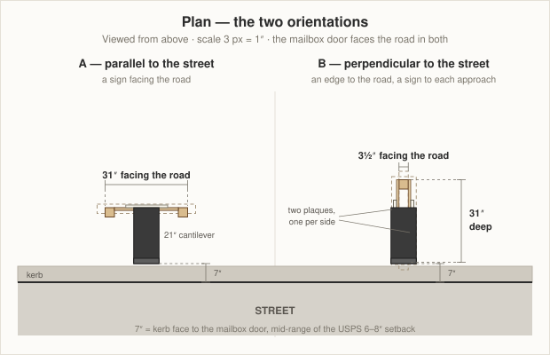
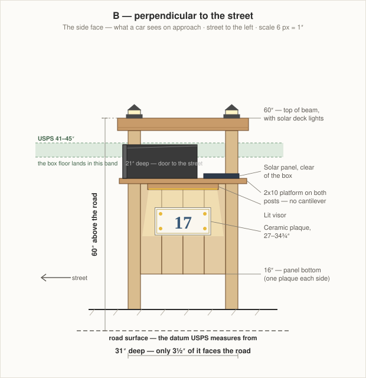

# Mailbox Post — Perpendicular
### Adoorn post-mount box on a 31" × 60" cedar frame, set end-on to the street

Two 4x4 posts standing in line pointing away from the road, a beam over the top, and the [Adoorn post-mount mailbox](https://www.adoorn.com/products/post-mount-mailbox) carried on a platform that spans both posts. The side panels between the posts each hold a ceramic address plaque, lit from a solar visor.

**This is the one to build.** It presents 3½" to traffic instead of 31", and the mailbox sits on two posts instead of hanging off a cantilever. See [the parallel version](MailboxPostParallel.md) for the alternative and why you might still want it.

**Key dimensions**

| | |
|---|---|
| Facing the road | 3½" — one post edge |
| Depth, front to back | 31" (posts 27½" on centre) |
| Top of beam | 60" above the road surface |
| Mailbox floor | 43" above the road |
| Kerb setback | 7" from the kerb face to the box door |
| Side panels | 24" × 25½", four 6" boards each, one per side |
| Post burial | 30" of tamped crushed stone, **no concrete** |

---

## 1. Why this orientation wins

**The mailbox needs no cantilever.** Its 21" length runs along the post line, so a platform spanning both posts carries it directly. In the parallel version that same box hangs 21" out into the road on knee braces. A carrier tugs on that door several hundred times a year, and mail piles up at the far end — the perpendicular layout puts all of that straight down onto two posts.

**It is a much smaller thing to hit.** A kerbside support is meant to give way when struck. This one shows a 3½" post edge to traffic rather than a 31" panel, so it catches far less wind and presents far less to a vehicle leaving the road. That matters more here than anywhere else in the design.

The street-side elevation above is the argument in one picture: **9½" wide at the mailbox, 3½" everywhere else**, against the ghosted 31" × 68" envelope of the parallel version drawn from the same viewpoint.

**Both approaches get a number.** One plaque on each side panel. A driver coming from either direction reads the number square-on for the whole approach, instead of glimpsing a street-facing panel once. Two tiles instead of one is the price, and it is worth paying.

**What you give up:** there is no billboard facing the road. If you want the number to read like a sign from directly across the street, build [the parallel version](MailboxPostParallel.md) instead.

---

## 2. The mailbox, and using your own post

The [Adoorn post-mount box](https://www.adoorn.com/products/post-mount-mailbox) is **9½"H × 9½"W × 21"D**, 15 lb, galvanized steel with a powder-coat finish, and — the part that matters — **approved by the USPS Postmaster General**. That removes the whole approval problem that sank the wall-mount box: a carrier cannot decline an approved kerbside box.

**Order it in Black** to match the shutters, the garage door hardware and the path lights already on the house.

### Replacing Adoorn's post

Adoorn sells a 51" in-ground post to go with it, and you are not using it. Skipping it costs nothing and gains you a lot — the height becomes yours to set, the plaques and the lighting get somewhere to live, and the whole thing is cedar rather than a steel tube.

The only thing you inherit from their system is the **bolt pattern**. Adoorn's mounting plate is 12" × 6" with a **10" × 4" hole spread**, and the box floor is drilled to match. Your platform just has to reproduce those four holes:

- **10" apart** along the box's length (front to back)
- **4" apart** across its width
- centred on the platform, with the box positioned as in §3

**Measure the holes on your actual box before you drill.** Set the box upside down on the platform blank, mark through its floor, and drill from the marks. A 10" × 4" pattern is easy to get 1/16" wrong from a spec sheet and impossible to get wrong from the box itself.

Use the hardware Adoorn supplies. If it is sized for a 6mm steel plate it may be too short for a 1½" platform — ¼-20 stainless bolts with a washer and a nylon-insert lock nut underneath are the substitute.

### Check for a flag

Kerbside boxes need a flag so you can signal outgoing mail. Adoorn's locking models list one; the no-lock model's listing does not say. **Check before ordering** — if it has no flag, a bolt-on replacement flag is about $10 and screws to the box's side.

---

## 3. The geometry the rules dictate

### 3.1 Heights are measured from the road

USPS measures from the **road surface**, not from your lawn. Your post stands behind the kerb where the ground is typically 4"–8" higher; get this wrong and a box carefully set at 43" above the grass sits at 37" above the road, out of band.

Every height on this page is **above the road surface**. Measure how much higher your ground is than the road at the post — call it **G**, 6" is typical — with a straightedge and a line level. Then:

- **Exposed post** = 60 − G (54" if G is 6")
- **Post to buy** = 90 − G, so an 8' stick covers every case

### 3.2 The 41"–45" band sets the platform

USPS wants the box floor 41"–45" above the road. **Set it at 43"** — mid-band, leaving 2" of margin each way for a resurfacing or a settled post. With a 1½" platform, the post tops land at **41½"**.

### 3.3 The setback sets where the box sits along the platform

USPS wants the box door 6"–8" back from the kerb face. Use **7"**.

The box is 21" long and the posts are 27½" apart, so the box does not reach both posts — the platform does that job, and the box sits wherever the setback puts it. Position the front post so its front face is **1½" behind the box door**. That keeps the post clear of the door swing while putting most of the box's weight over it. The platform then runs 36" front to back, leaving about 10" of clear deck behind the box.

That leftover deck is not waste. It is where the solar panel goes, out of the box's shadow and out of the carrier's way.

---

## 4. How it goes together

**The 24" clear span comes from the boards.** A 1x8 is really 7¼" wide. Rip four to 6" and you get 24" exactly. Add the two 3½" posts and the frame is 31" front to back.

**The beam sits on top of the posts** — no half-lap, just two structural screws down into each post's end grain. It runs front to back, 37" long with a 3" overhang at each end, and it carries the two solar deck lights.

**Two side panels, not one.** Each side of the post pair gets its own panel and its own set of four rails, because each side gets its own plaque. The result is a hollow box section between the posts, which is considerably stiffer than a single panel would be.

**The panels are a skin, not the structure.** Four 2x4 rails per side do that work, and each rail exists because a specific screw has to land in it.

| Rail | Height | Backs |
|---|---|---|
| R1 | 38 – 41½" | panel top, and the visor |
| R2 | 32½ – 36" | plaque, upper hole |
| R3 | 26 – 29½" | plaque, lower hole |
| R4 | 16 – 19½" | panel bottom |

Four per side, eight in total, all 24" long. Rails are set back ¾" from the post side faces so the panel boards finish flush with the posts.

**Those heights assume the plaque's holes sit about ½" in from its top and bottom edges.** Dry-fit and mark before you close the panels — see step 6.

---

## 5. Finish

The house is cream lap siding with **charcoal-black shutters and hardware**, white trim, a fieldstone skirt and black path lights along the walkway.

Natural cedar is the wrong answer — cedar is a warm tan against a warm cream and the two read as a near-miss. **Finish the post in a charcoal-black semi-solid exterior stain matched to the shutters.** The black mailbox then merges into the post, and the white-and-yellow plaques become the only bright objects, which is exactly what a passing driver should find.

Two cheap touches: a white-painted ¾" × 1½" trim frame around each plaque, echoing the window trim; and a small bed of fieldstone at the base, echoing the garage skirt and keeping the trimmer off the posts.

---

## 6. The lighting

**The visors do the work.** A ¾" × 5" × 20" cedar board hangs under each platform edge at 41½", tilted 20° down and forward, with a waterproof warm-white LED strip along its underside washing the plaque below. The solar panels sit on the platform deck behind the box, or on the beam top — both are clear of shade.

Two details separate a lit number from a glare spot:

- **Warm white, 2700–3000K.** Cool white goes blue against cream siding and makes glossy ceramic look like a phone screen.
- **Graze it, don't face it.** The plaque is glossy; light aimed straight at it bounces back as a hot spot. The 20° tilt throws light down across the face instead.

**The beam lights are ambient.** Flat-base solar deck lights screwed to the beam top over each post — buy the screw-down kind, because a slip-over 4x4 cap has nowhere to go when a beam covers the post tops. Buy them black.

Solar downlights are dim. Get strip kits with the largest **separate** panel you can find; a panel built into the fixture will not charge under a visor. If they disappoint, two black solar spot lights staked at the base uplighting the panels work very well and need no wiring.

---

## 7. Materials

Rough 2026 prices; stock varies by store.

| Part | Product | Qty | ~Cost |
|---|---|---|---|
| Posts | 4x4 × 8' ground-contact pressure-treated | 2 | $36 |
| Beam | 4x4 × 8' cedar | 1 | $48 |
| Panels + visors | 1x8 × 8' cedar | 4 | $120 |
| Rails | 2x4 × 8' cedar | 2 | $26 |
| Platform | 2x10 × 8' cedar | 1 | $55 |
| Footings | ½ cu ft bag of ¾" crushed stone | 6 | $30 |
| Finish | 1 qt charcoal semi-solid exterior stain | 1 | $30 |
| Fasteners | stainless / hot-dip galvanised | — | $55 |
| | | | **$400** |

**Posts must be ground-contact pressure-treated (UC4A), not cedar** — it is the buried part that fails, and 30" in wet soil is where cedar disappoints. Stained charcoal it is indistinguishable. Everything above grade is cedar. Let PT dry a couple of weeks before staining.

| Mounted hardware | Qty | ~Cost |
|---|---|---|
| [Adoorn Post Mount Mailbox (No Lock), black](https://www.adoorn.com/products/post-mount-mailbox) | 1 | check current price |
| [Ceramic tile plaque, 15¾" × 7¾"](https://www.amazon.com/Yellow-Flowers-Address-Ceramic-Number/dp/B0BM6Q8RH7/) — **two, one per side** | 2 | $90 |
| Bolt-on mailbox flag, black (if the box has none) | 1 | $10 |
| Solar deck light, flat screw-down base, black | 2 | $30 |
| Solar LED strip kit, warm white, separate panel | 2 | $56 |
| | | **$186 + box** |

---

## 8. Cut list

G is your ground height above the road, from §3.1.

| Part | Size | Qty | Yield |
|---|---|---|---|
| Post | 4x4 × (90 − G)" — 84" if G is 6" | 2 | one 8' stick each |
| Beam | 4x4 × 37" | 1 | one 4x4 × 8', 59" left over |
| Platform | 2x10 × 36" | 1 | one 2x10 × 8' |
| Rail | 2x4 × 24" | 8 | four per 8' board; 2 boards |
| Panel board | ¾" × 6" × 25½" | 8 | three per 1x8 × 8' after ripping to 6"; 3 boards |
| Visor | ¾" × 5" × 20" | 2 | fourth 1x8 |
| Visor cheek | ¾" triangle, 5" × 2" | 4 | fourth 1x8 |

---

## 9. Build steps

**1 — Find the datum and set out.** Run a straightedge from the kerb top back to the post line and measure G with a line level. Mark the box door line at **kerb face + 7"**, the front post's front face 1½" behind that, and the rear post 27½" further back on centre — all on a line square to the road.

**2 — Set the posts.** Dig two 10"-diameter holes 30" deep. Put 4" of crushed stone in the bottom of each, stand the posts, brace them plumb both ways, and backfill with crushed stone in 4"–6" lifts, **tamping hard between every lift**. No concrete. Loose backfill is the failure mode here.

Check that the posts are square to the road and that their two side faces are in plane before you tamp — the panels depend on it. Screw a scrap across each side face as a temporary spacer and leave it while you tamp.

**3 — Fit the platform.** Cut the 2x10 to 36" and lay it across both post tops with its top at **43"**, positioned front-to-back as in §3.3. Two ¼" × 6" structural screws down into each post's end grain, counterbored.

**4 — Drill the bolt pattern.** Set the box upside down on the platform, mark through its floor holes, drill, and dry-mount it. Check the door swings clear of the front post and that the floor is at 43" from the road. Take it back off.

**5 — Fit the beam.** Cut the 4x4 to 37", chamfer the ends, and sit it across the post tops at 60" with a 3" overhang each end. Two ¼" × 6" structural screws into each post. Cut a ⅜" wire groove along the beam's underside while it is still off the posts.

**6 — Hang the rails, then dry-fit.** Cut eight 2x4s to 24" and set them at the §4 heights on both sides, front faces ¾" back from the post side faces — use a ¾" scrap as a gauge block. Then hold each plaque up and mark where its holes actually fall. **If a hole misses its rail, move the rail.** Do this now; once the panels are on you cannot reach behind them.

**7 — Rip and fit the panels.** Rip 1x8s to 6" wide, cut eight boards to 25½", and screw them to all four rails per side, two screws per board per rail. Leave 1/16" between boards for movement.

**8 — Build and hang the visors.** Cut two visor boards and four triangular cheeks. Screw the cheeks under the platform edge at 20°, then the visors to the cheeks. Run the wires, mount the solar panels on the platform deck behind the box.

**9 — Finish before the hardware goes on.** Two coats of charcoal semi-solid stain on everything, end grain first and twice. Do not skip the top of the platform — it is the surface that gets the most water — or the underside of the beam. Let it cure.

**10 — Mount the hardware.** Plaques, then the mailbox, then the flag. Seal behind each plaque screw hole with a dab of clear exterior sealant.

**11 — Verify, then check at night.** Measure the box floor from the road one more time and confirm the 7" setback. Give the solar a full day of sun, then stand where the carrier stops and see whether you can read the number.

---

## 10. Notes and cautions

- **Call 811 before you dig.** Two 30" holes at the road edge is exactly the depth and place that finds an irrigation line, a lighting run or a water service. Free, takes a few days — call before you buy lumber.
- **Check the right-of-way.** The strip between the kerb and the property line often belongs to the town, and a structure standing in it is theirs to remove.
- **Snow and plough wash.** A kerbside post takes the full load of ploughed snow. The panel bottom at 16" keeps the boards out of most of it. Do not plant anything at the base you would mind losing.
- **The panels will move.** Cedar boards 6" wide shrink and swell across the grain by up to 1/16" through the year. The gaps are deliberate — do not close them and do not caulk them.
- **Re-check the height after the first winter.** A tamped-stone footing is meant to be less rigid than concrete, and a post that has settled or leaned an inch can put you out of the 41"–45" band. Five minutes with a tape.
- **Repaving raises the road.** Two inches of new asphalt eats your lower margin, which is why the box floor is set at 43" and not 41".

---

← [Parallel version](MailboxPostParallel.md) · [DIY projects](README.md) · [Wiki home](../README.md)
